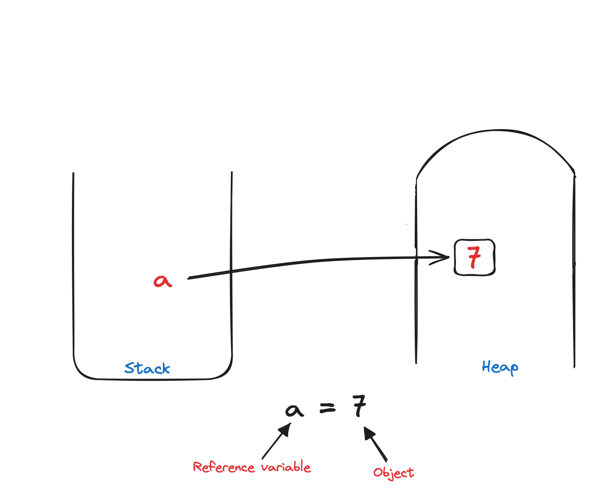
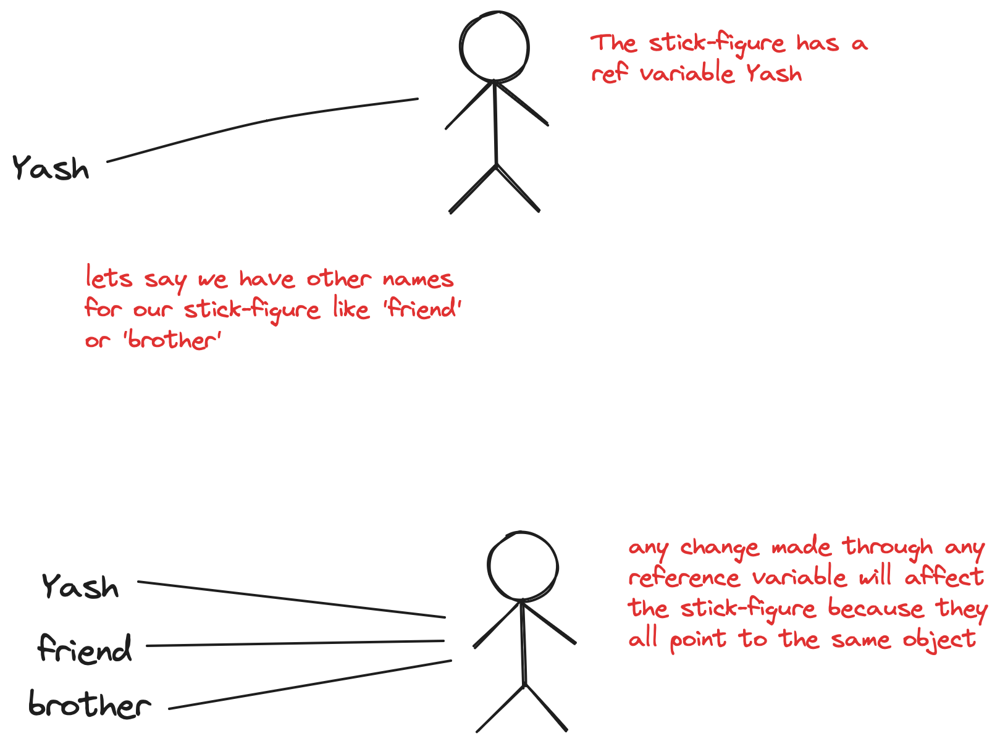

# Introduction to Languages

 

## Types of Languages

#### Procedural

- Specifies a series well structured steps to compose a program.
- They utilize procedures or routines to execute tasks.
- They emphasize control flow structures like loops and conditionals.
- They are often used for system programming and applications development.
- They are efficient for low-level programming tasks and performance-critical applications.
- Common examples include C, Pascal, and BASIC.

#### Functional

- Focuses on evaluating mathematical functions to perform computation.
- Avoids mutable state and side effects.
- Used in situations where we have to perform lots of different operations on the same set of data such as ML.
- Suitable for concurrent and parallel programming.
- Examples include Haskell, Clojure, and Erlang.

#### Object-Oriented

- Organizes code around objects that encapsulate data and behavior.
- Code + Data = Object
- Developed to make it easier to develop, debug, reuse, and maintain software.
- Promotes concepts like inheritance, polymorphism, and encapsulation.
- Encourages modular design and code organization.
- Commonly used in software development for modeling real-world entities.
- Examples include Java, C++, and Python.

 

## Static V/S Dynamic Languages

| Static Languages                                    | Dynamic Languages                                    |
| --------------------------------------------------- | ---------------------------------------------------- |
| Type Checking done at compile-time                  | Type Checking done at runtime                        |
| Variables must be declared with specific data types | Variables are declared without specifying data types |
| Less flexible, types are fixed at compile-time      | More flexible, types can change dynamically          |
| Generally offers better performance                 | Often slower due to runtime type checks              |
| May require more time for compilation and debugging | Faster development cycles due to less strict syntax  |
| Errors are often caught at compile-time             | Errors may only be detected at runtime               |
| Examples: C, C++, Java, C#                          | Examples: Python, JavaScript, Ruby, PHP              |

 

## Memory Management

Memory managemnt is a key concept in any programming language. In Java, it refers to the process of allocating and deallocating memory resources efficiently for programs to run smoothly.

#### Automatic Memory Management

- Java automatically handles memory allocation and deallocation for objects.
- It simplifies the development process by eliminating the need for developers to manually track memory usage and manage it.
- Developers can focus on writing code without worrying about memory management tasks, leading to faster development cycles and reduced likelihood of memory-related bugs.

#### Garbage collection

- It is an automatic process where the Java identifies and removes objects from memory that are no longer in use or referenced by the program.
- It helps prevent memory leaks by reclaiming memory occupied by objects that are no longer reachable or referenced, ensuring efficient memory usage over the lifetime of the program.

#### Stack and Heap Memory

- The heap is where objects are allocated dynamically
- The stack is used to store method calls and local variables.
- Memory for objects is allocated on the heap, and references to those objects are stored in the stack.

 

## Objects and Reference Variables

 
