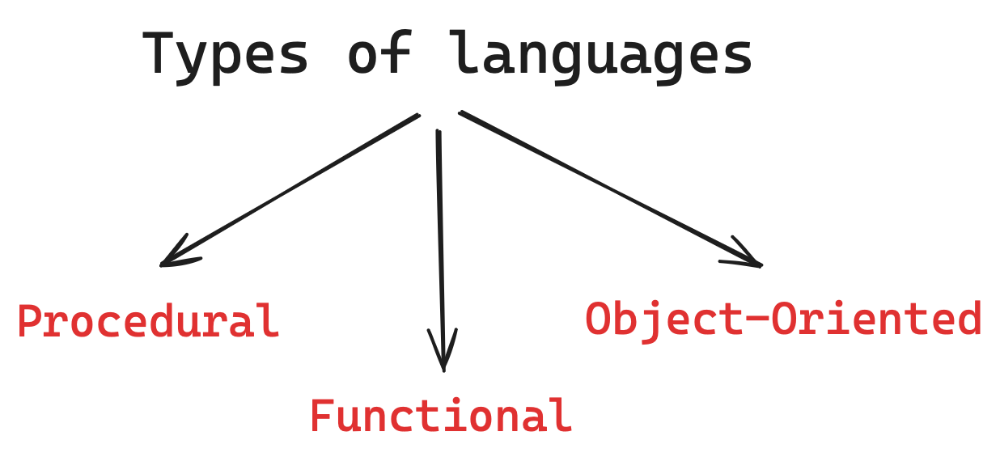

# Introduction to Languages

### Types of Languages

 

#### Procedural

- Specifies a series well structured steps to compose a program.
- They utilize procedures or routines to execute tasks.
- They emphasize control flow structures like loops and conditionals.
- They are often used for system programming and applications development.
- They are efficient for low-level programming tasks and performance-critical applications.
- Common examples include C, Pascal, and BASIC.

#### Functional

- Focuses on evaluating mathematical functions to perform computation.
- Avoids mutable state and side effects.
- Used in situations where we have to perform lots of different operations on the same set of data such as ML.
- Suitable for concurrent and parallel programming.
- Examples include Haskell, Clojure, and Erlang.

#### Object-Oriented

- Organizes code around objects that encapsulate data and behavior.
- Code + Data = Object
- Developed to make it easier to develop, debug, reuse, and maintain software.
- Promotes concepts like inheritance, polymorphism, and encapsulation.
- Encourages modular design and code organization.
- Commonly used in software development for modeling real-world entities.
- Examples include Java, C++, and Python.

 

## Static V/S Dynamic Languages

| Static Languages                                                              | Dynamic Languages                                                                  |
| ----------------------------------------------------------------------------- | ---------------------------------------------------------------------------------- |
| Types are checked at compile time, offering early detection of errors.        | Types are checked at runtime, providing flexibility during development.            |
| Generally faster execution due to compile-time optimizations.                 | Tend to have slower execution compared to statically typed languages.              |
| May require more upfront planning but can lead to fewer runtime errors.       | Rapid prototyping is facilitated, allowing for quick iteration during development. |
| Often less flexible as types are fixed at compile time.                       | Offers greater flexibility as types can be determined dynamically.                 |
| Easier to maintain due to explicit type declarations and compile-time checks. | May require more effort for maintenance due to potential runtime errors.           |
